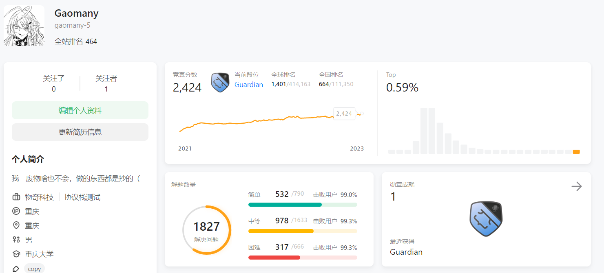

# LeetCodeTemplate-Python

力扣未解之谜：

855. 考场就座

854. 相似度为 K 的字符串
 
887. 鸡蛋掉落

903. DI 序列的有效排列

910. 最小差值 II

913. 猫和老鼠

932. 漂亮数组

943. 最短超级串

960. 删列造序 III
 
963. 最小面积矩形 II

964. 表示数字的最少运算符

992. K 个不同整数的子数组

1000. 合并石头的最低成本

1040. 移动石子直到连续 II

1092. 最短公共超序列

1192. 查找集群内的关键连接

1203. 项目管理

1330. 翻转子数组得到最大的数组值

1388. 3n 块披萨
