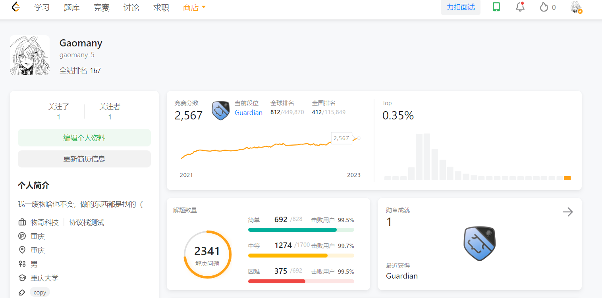

# LeetCodeTemplate-Python

### 构造

[循环码](./construct/CyclicCode.py)

[无重复全排列](./construct/PermuteUnique.py)

### 转换

[10进制k进制相互转换(k<10)](./convert/BaseK.py)

[数组转二叉搜索树](./convert/BST.py)

[链表数组相互转换](./convert/ListNode.py)

[带括号的字符串转嵌套数组](./convert/Parentheses2NestedArray.py)

### 动态规划

[数位DP(统计大于0的数量)](./dp/DigitDP.py)

[最短递增子序列](./dp/LIS.py)

[换根DP(lc:834. 树中距离之和)](./dp/RerootingDP.py)

[树上倍增-树或基环树,单纯找节点](./dp/TreeDoubling.py)

[树上倍增2-树或基环树,带值传递](./dp/TreeDoubling2.py)

### 图

[联通分量-网格图(耗时)](./graph/ConnectedComponent-Grid.py)

[单源最短路径(Dijkstra)](./graph/Dijkstra.py)

[最大网络流(Dinic)](./graph/Dinic.py)

[单源最短路径(Floyd)](./graph/Floyd.py)

[网格广搜](./graph/GridSearch.py)

[欧拉回路,即一笔画问题(Hierholzer)](./graph/Hierholzer.py)

[割点与桥(Tarjan)](./graph/Tarjan.py)

[拓扑排序](./graph/TopologicalSort.py)

[并查集](./graph/UnionFind.py)

### 贪心

[将所有元素修改为同一个值](./greedy/MedianMove.py)

### 区间

[有序且合并的区间](./interval/Interval.py)

### 查询

[二维差分](./query/Difference-2D.py)

[质数(欧拉筛)](./query/Prime.py)

### 字符串

[KMP](./string/KMP.py)

[回文子串数量(Manacher)](./string/Manacher.py)

[滚动哈希(单进制)](./string/RollingHash.py)

[滚动哈希(双进制)](./string/RollingHash2.py)

### 树

[二叉树(已预处理)](./tree/BinaryTree.py)

[常规树(已预处理)](./tree/GeneralTree.py)

[线段树](./tree/SegmentTree.py)

[前缀树](./tree/Trie.py)

### 力扣未解之谜：

855. 考场就座

854. 相似度为 K 的字符串

903. DI 序列的有效排列

910. 最小差值 II

913. 猫和老鼠

932. 漂亮数组

943. 最短超级串

960. 删列造序 III
 
963. 最小面积矩形 II

964. 表示数字的最少运算符

992. K 个不同整数的子数组

1000. 合并石头的最低成本

1040. 移动石子直到连续 II

1092. 最短公共超序列

1192. 查找集群内的关键连接

1203. 项目管理

1330. 翻转子数组得到最大的数组值

1388. 3n 块披萨
